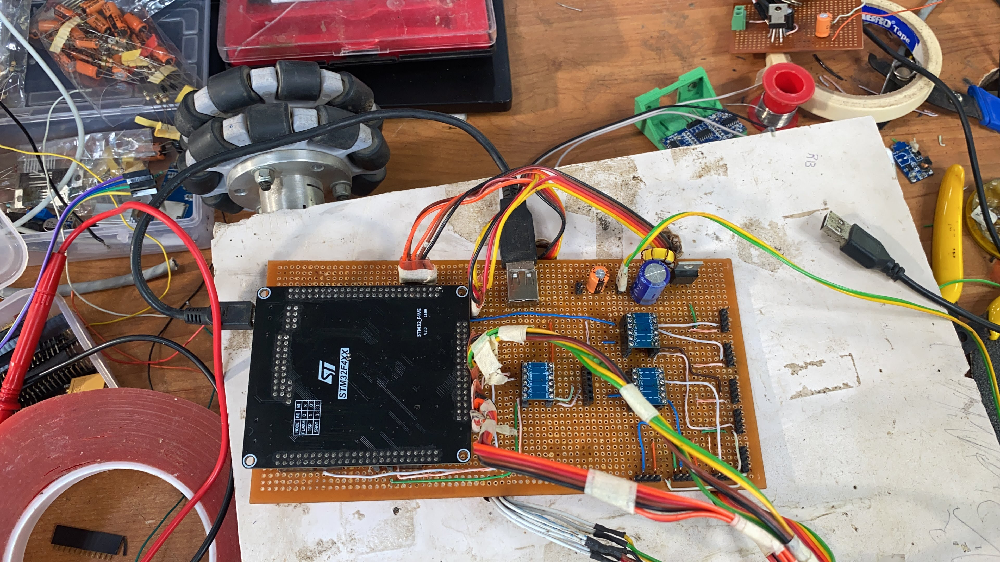

# **Autonomous Mobile Robot**
## Overview
The Home-Service Robot project was a final year project focused on implementing the Artificial Potential Field (APF) algorithm for path planning and later transitioned into using the Robot Operating System (ROS) for enhanced capabilities. This project showcases the integration of various robotics technologies to demonstrate a mobile robot's autonomous navigation and manipulation abilities in a simulated environment.

## Design and Implementation

The Home-Service Robot project involves the design and implementation of a robot prototype. This image shows the prototype's hardware setup, including sensors and controllers integrated on a custom PCB.

## Key Components
ROS: Provides a flexible framework for writing robot software.
Gazebo: Used for simulating the robot and its environment.
Mapping: Utilizes the gmapping package for creating a 2D occupancy grid map.
Localization: Employs the Adaptive Monte Carlo Localization (AMCL) package for precise positioning.
Path Planning: Implements the Artificial Potential Field (APF) algorithm for obstacle avoidance and navigation.

## Demonstrations
Video Demonstration
<iframe width="560" height="315" src="https://www.youtube.com/embed/uRn-orebpmM?si=dU0EQKZzu-dAfugp" title="YouTube video player" frameborder="0" allow="accelerometer; autoplay; clipboard-write; encrypted-media; gyroscope; picture-in-picture; web-share" referrerpolicy="strict-origin-when-cross-origin" allowfullscreen></iframe>
This video showcases the Home-Service Robot performing autonomous navigation and task execution in the simulated environment.

