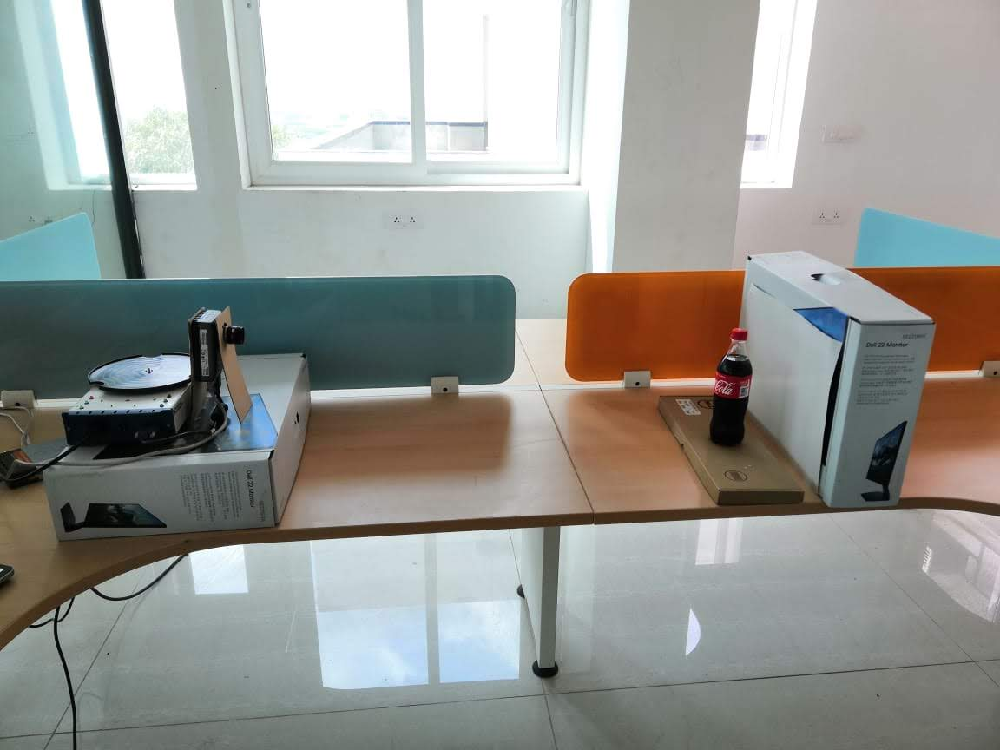
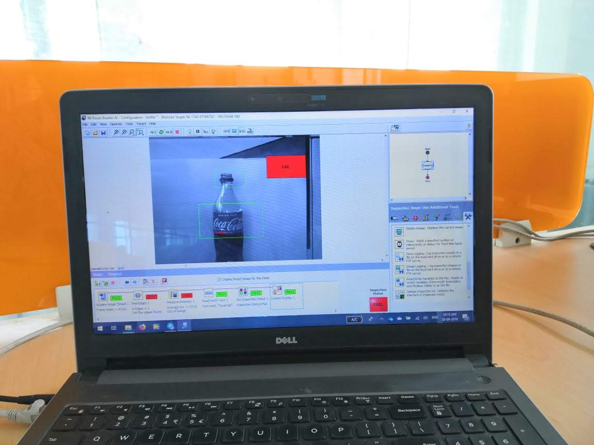
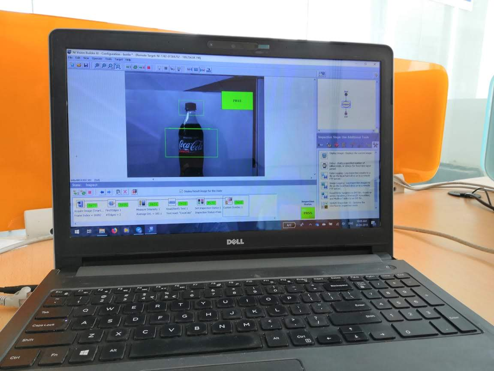

# **LabVIEW-Based Bottle Inspection System Using NI Smart Camera**
## Problem Statement
In the beverage industry, maintaining the quality and integrity of bottled products is critical. Manual inspection processes are often error-prone and inefficient, leading to potential defects such as incorrect labeling or damaged bottles going unnoticed. To enhance quality control and operational efficiency, there is a need for an automated inspection system that can accurately and consistently detect defects and labeling errors.

## Solution
The solution involves developing an automated bottle inspection system using a National Instruments (NI) Smart Camera and LabVIEW software. This system leverages computer vision technology to inspect bottles on a production line. The key components of the solution include:

NI Smart Camera: Captures high-resolution images of the bottles for inspection.
LabVIEW Software: Processes the captured images using advanced computer vision algorithms to detect defects and verify labels.
Turntable: Rotates bottles to allow for a 360-degree inspection.
Integration with Production Line: Ensures seamless operation with existing manufacturing processes.
## Demonstration
The demonstration setup consists of the following:

NI Smart Camera positioned to capture detailed images of bottles placed on a turntable.
Turntable that rotates each bottle, enabling comprehensive inspection from all angles.
LabVIEW Interface running on a connected computer, which processes the images captured by the NI Smart Camera.
Real-Time Feedback displayed on the LabVIEW interface, indicating pass or fail status based on the inspection results.
Images of the Setup and Interface

**Setup**

**Defect Detection**

**All Clear**

## Results
The LabVIEW-based bottle inspection system utilizing the NI Smart Camera and computer vision technology successfully identified defects and labeling errors. The system demonstrated high accuracy and efficiency in detecting issues, significantly reducing the likelihood of defective products reaching consumers. The automated inspection process proved to be faster and more reliable than manual methods, enhancing overall quality control and operational efficiency within the production line.
only 3 lines from the website view. Worst case scenarios  4lines.
