# **Mobile Robotics Competition**
## Problem Statement
Design, build, and program a mobile robot to autonomously navigate and perform tasks. The robot must demonstrate precision, efficiency, and adaptability to varying conditions.

Images
Competition Image

## **Competition Achievements**
## 2018 State Level Competition
Participated and showcased mobile robotics skills.
Achieved recognition for innovative robot design and programming.
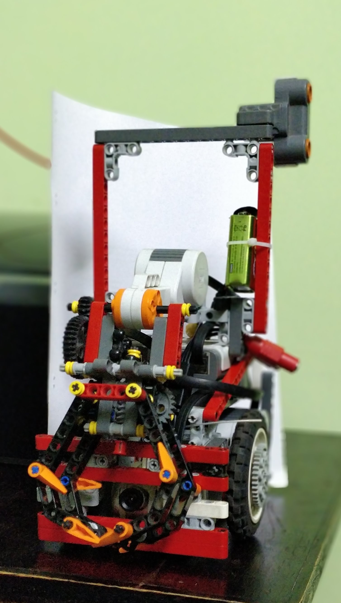
## 2018 Regional Competition
Competed against top teams from various regions.
Demonstrated advanced robotics capabilities and secured top positions.
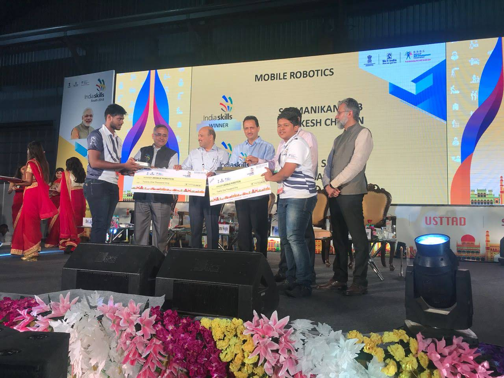
## 2018 National Level Competition
Competed at the national level, showcasing technical prowess in mobile robotics.
Earned a Silver medal for outstanding performance.
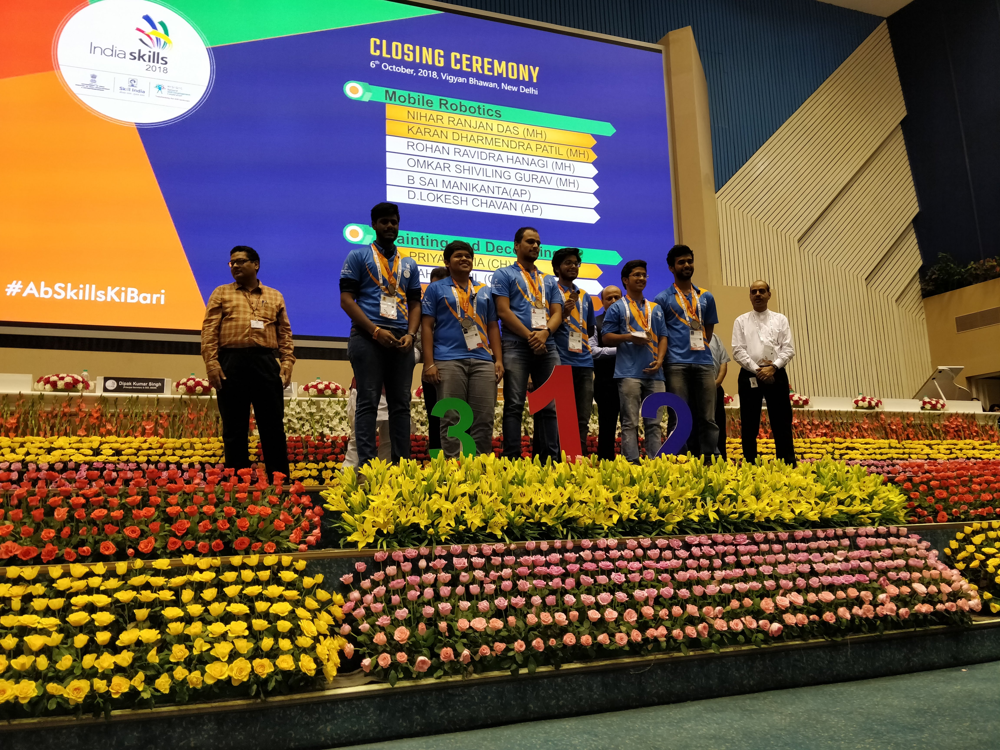

## 2021 State Level Competition
Continued excellence in mobile robotics, building on previous successes.
Secured a Gold medal, highlighting superior design and programming skills.
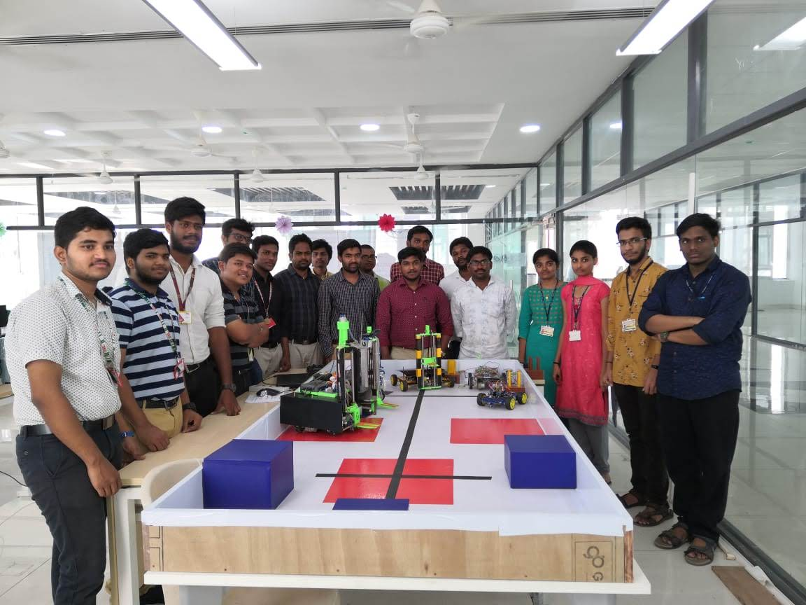

## Gallery

### 2018 Mobile Robotics Competition
<table>
  <tr>
    <td>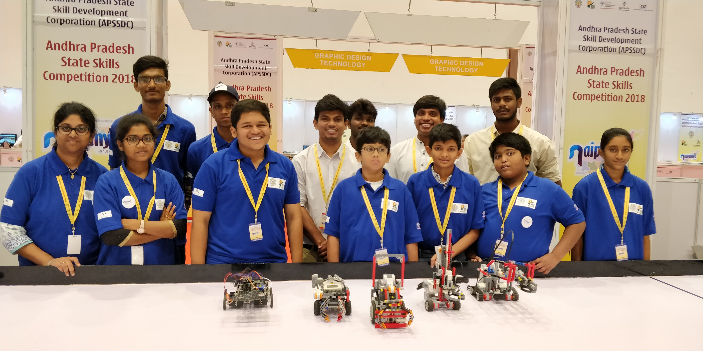</td>
    <td>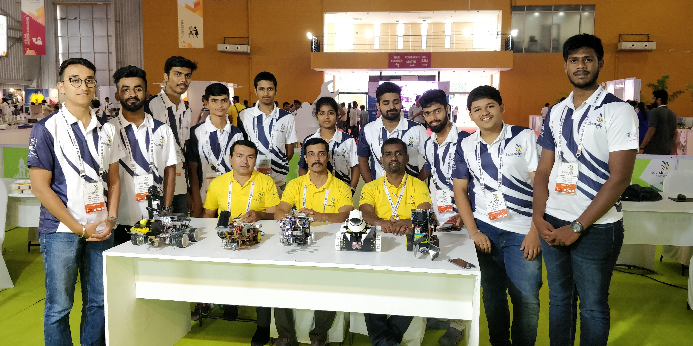</td>
    <td>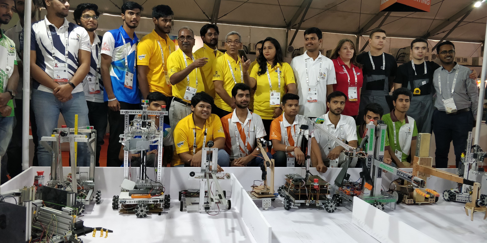</td>
  </tr>
  <tr>
    <td>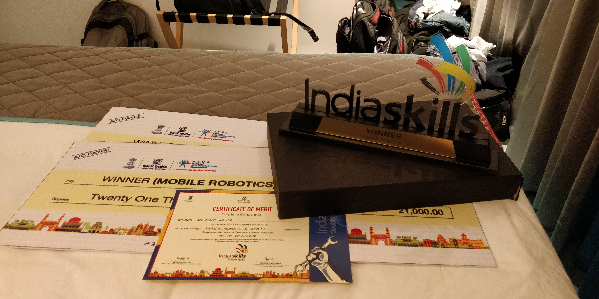</td>
    <td></td>
  </tr>
</table>

### 2021 State Level Competition
<table>
  <tr>
    <td>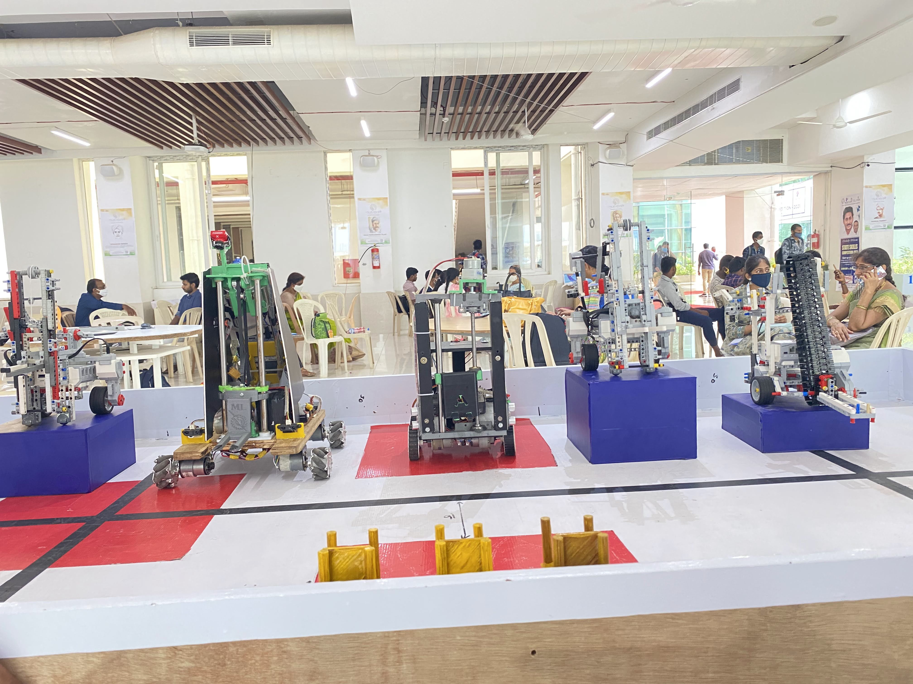</td>
    <td>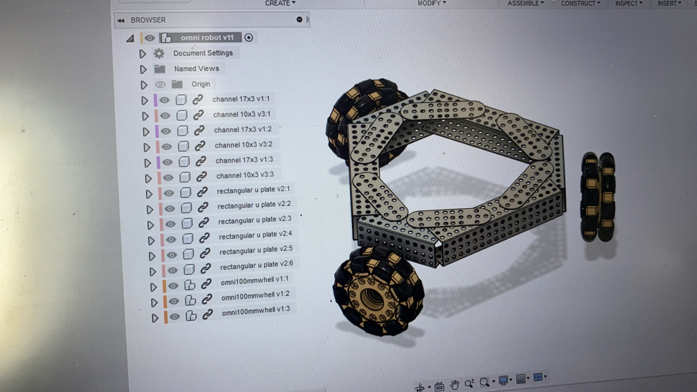</td>
    <td>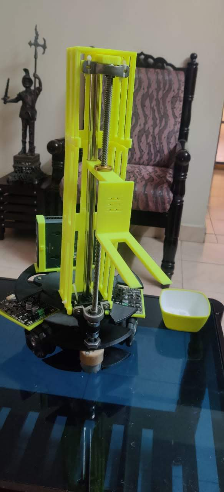</td>
  </tr>
  <tr>
    <td colspan="3">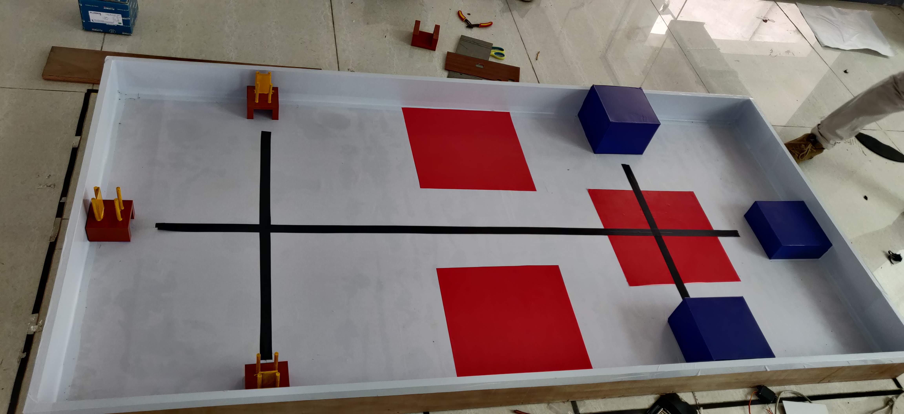</td>
  </tr>
</table>

