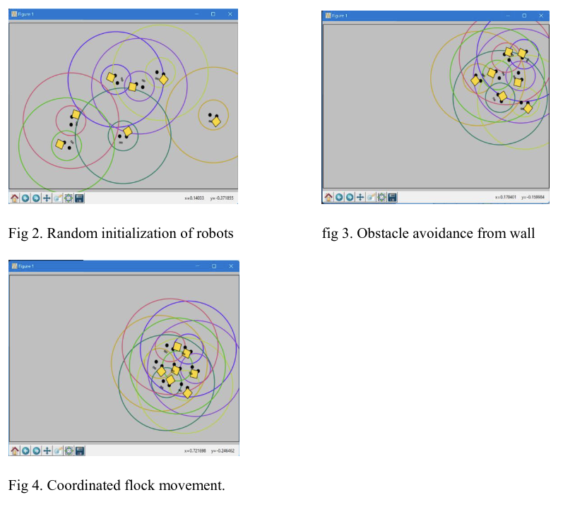
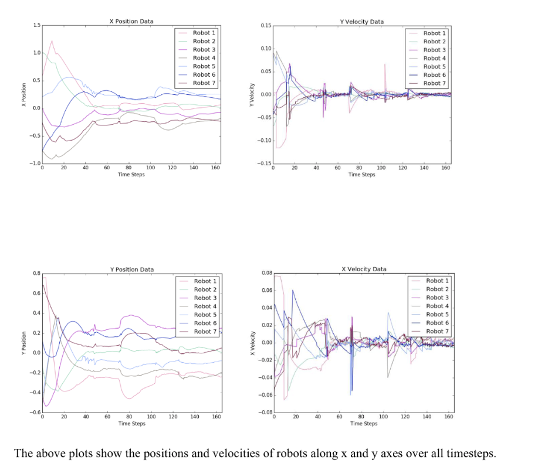
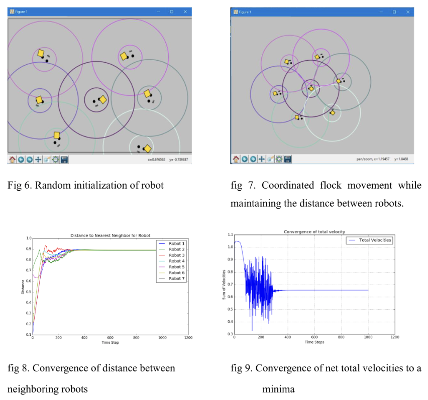

# Boids Flocking Algorithm for Sanitation and Hygiene Operations

## Problem Statement
Implementing the Boids Flocking Algorithm to create a swarm of robots capable of efficiently covering large areas for sanitation and hygiene operations. The primary goal is to apply this algorithm within the health sector to clear areas of infectants, ensuring meticulous attention to detail and comprehensive coverage.

## Mathematical Model

### Approach 1: Boids Algorithm

- Boid agents \( B = \{b_i, i = 1, 2, 3, \ldots, n\} \).
- Boids within the field of view \( N_i = \{b_i \in B; \forall b_j: |b_j - b_i| \leq L, j = 1, 2, 3, \ldots, f_a\} \).
- Position \( l_i \) and velocity \( v_i \) of Boid \( b_i \).
- Alignment \( a_i \), cohesion \( c_i \), and separation \( s_i \) terms.
- Next position \( l_j = l_i + v_i + X_a a_i + X_c c_i + X_s s_i \).

### Approach 2: Potential Fields

- System of \( N \) robots with position \( r_i \), velocity \( v_i \), and acceleration \( a_i \).
- Heading \( \theta_i = \arctan2(\dot{r_i}, \dot{r_i}) \).
- Control input \( a_i = a_{r_i} + a_{\theta_i} \).
- Stability and convergence analysis using potential functions.

## Demonstrations
### Approach 1: Boids Algorithm
<iframe width="560" height="315" src="https://youtube.com/embed/4Hyo5M2sebk?si=dK37JoPyO-3W53qo" title="YouTube video player" frameborder="0" allow="accelerometer; autoplay; clipboard-write; encrypted-media; gyroscope; picture-in-picture; web-share" referrerpolicy="strict-origin-when-cross-origin" allowfullscreen></iframe>

### Approach 2: Boids Algorithm
<iframe width="560" height="315" src="https://www.youtube.com/embed/AK1TjbmK0lc?si=_16cbDyOv2kfrEGg" title="YouTube video player" frameborder="0" allow="accelerometer; autoplay; clipboard-write; encrypted-media; gyroscope; picture-in-picture; web-share" referrerpolicy="strict-origin-when-cross-origin" allowfullscreen></iframe>

## References
- [Boids Algorithm by Van Hunter Adams](https://vanhunteradams.com/Pico/Animal_Movement/Boids-algorithm.html)
- Choi T, Ahn C. "Artificial life based on boids model and evolutionary chaotic neural networks for creating artworks." Swarm Evol Comput 2019;47:80–9.
- Tanner, H. G., Jadbabaie, A., & Pappas, G. J. (2003). "Stability of Flocking Motion." University of Pennsylvania. Technical Report No: MS-CIS-03-03.
- R. Olfati-Saber, "Flocking for multi-agent dynamic systems: algorithms and theory," IEEE Transactions on Automatic Control, vol. 51, no. 3, pp. 401-420, March 2006, doi: 10.1109/TAC.2005.864190.
