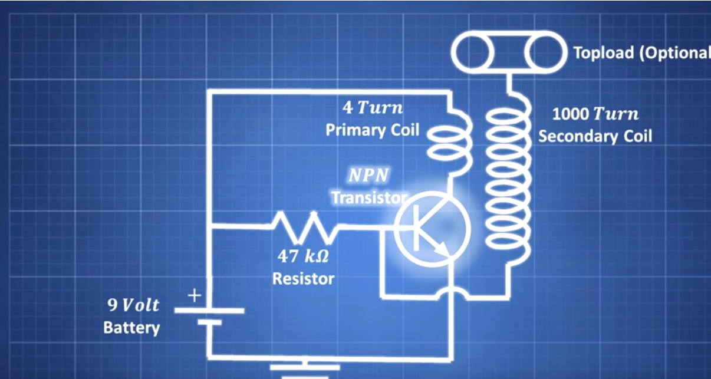

# Tesla Coil
## Problem Statement
The goal of this project is to design and construct a Tesla Coil using readily available electronic components. A Tesla Coil is a type of resonant transformer circuit that generates high-voltage, low-current, high-frequency alternating-current electricity. The purpose of this project is to demonstrate the principles of electromagnetic induction, resonance, and high-voltage generation. By building a Tesla Coil, we aim to understand the practical challenges and considerations involved in working with high-voltage circuits, as well as the safety precautions necessary for handling such equipment.

## Circuit

The circuit consists of a 9V battery connected to a primary coil with 4 turns of 10AWG wire. The primary coil is connected in series with a 47kΩ resistor and an NPN transistor (TIP31C). The transistor switches the current through the primary coil, creating a rapidly changing magnetic field. This induces a high voltage in the secondary coil, which has 1000 turns of 26 to 32AWG wire. An optional topload can be added to enhance the voltage output. The secondary coil's high voltage creates visible sparks, demonstrating the Tesla Coil's operation.

## Demostrations
<iframe width="900" height="500" src="https://youtube.com/embed/CAkqhIoBDZ4?si=QSQ08U4ED8VSIvKu" title="YouTube video player" frameborder="0" allow="accelerometer; autoplay; clipboard-write; encrypted-media; gyroscope; picture-in-picture; web-share" referrerpolicy="strict-origin-when-cross-origin" allowfullscreen></iframe>

## Materials
10AWG Wire Roll
26 to 32AWG Wire Spool
Power Supply/Battery (9V to 30V)
TIP31C NPN Transistor (Several)
47000 Ohm Resistor

## Results
The constructed Tesla Coil successfully demonstrated the generation of high-voltage arcs. The demonstration showed clear electromagnetic induction, with the coil generating visible sparks and providing a hands-on illustration of the Tesla Coil's operational principles.